# ClaimLens — Full Feature Walkthrough

> **Side-by-side proof that standard LLMs echo viral hoaxes while a multi-agent pipeline catches the lie — demonstrated across 4 real-world claims.**

---

## Table of Contents

1. [Home Page](#1-home-page)
2. [Preset: Hot Lemon Water (Medical Hoax)](#2-hot-lemon-water--medical-hoax)
3. [Preset: NASA Alien Signal (Tech Hoax)](#3-nasa-alien-signal--tech-hoax)
4. [Preset: US Cash Ban (Policy Misinfo)](#4-us-cash-ban--policy-misinfo)
5. [Preset: Leqembi FDA Approval (Real News)](#5-leqembi-fda-approval--real-news)
6. [Feature Reference](#6-feature-reference)

---

## 1. Home Page

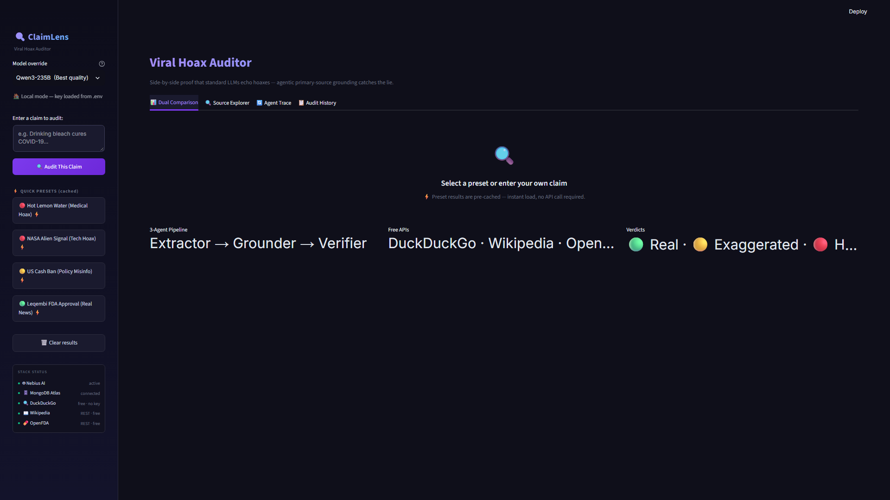

**What you see:**
- **Left sidebar** — Enter a custom claim or click a preset. The sidebar also shows the STACK STATUS panel (5 components: Nebius AI, MongoDB Atlas, DuckDuckGo, Wikipedia, OpenFDA) and model selector.
- **Main area** — The 4 navigation tabs: Dual Comparison, Source Explorer, Agent Trace, Audit History.
- **Empty state** — Before any claim is submitted, the comparison columns show placeholder text.

**Key interaction:** Click any preset button in the sidebar for instant results (no API key required — served from pre-computed cache in milliseconds).

---

## 2. Hot Lemon Water — Medical Hoax

> **Claim:** "Harvard study proves hot lemon water cures diabetes in 30 days — doctors won't tell you this!"
> **Expected:** 🔴 Fabricated

### Tab 1: Dual Comparison

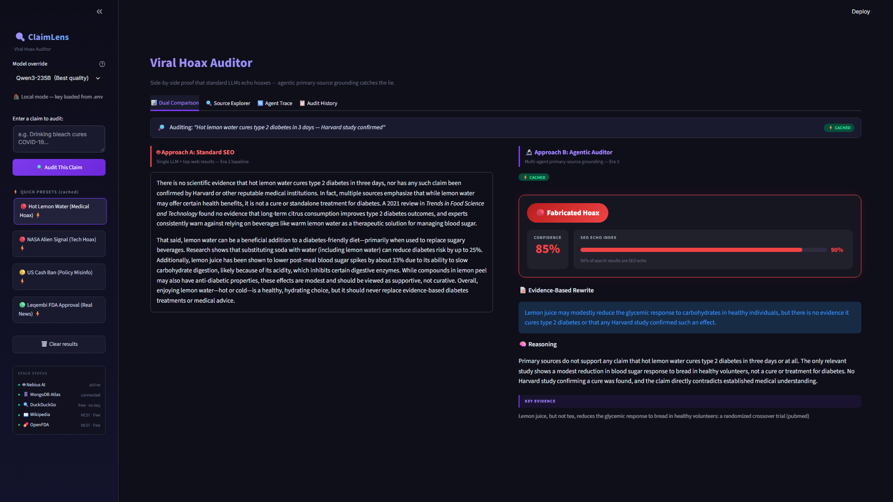

**Left column (Approach A — Era 2 Baseline):**
The single-prompt LLM reads the top DuckDuckGo results and synthesizes them into confident-sounding prose. Health blogs and wellness sites dominate the search results, so the output echoes the claim's framing — talking about potential benefits of lemon water, glycemic effects, and antioxidants — without ever verifying the Harvard study.

**Right column (Approach B — Multi-Agent Auditor):**
- **Verdict card:** 🔴 Fabricated with confidence score
- **SEO Echo Chamber Index bar:** Shows ~90% of DuckDuckGo results are non-primary sources — the SEO echo chamber is almost total
- **Rewritten claim:** The corrected, evidence-based version of the claim
- **Key evidence bullets:** What the primary sources actually say
- **Primary sources cited:** PubMed link with the actual glycemic study

**The contrast:** Approach A sounds authoritative but echoes the lie. Approach B finds the one real study, reads it, and reports: "modest glycemic effect in healthy subjects only — no Harvard study found."

---

### Tab 2: Source Explorer

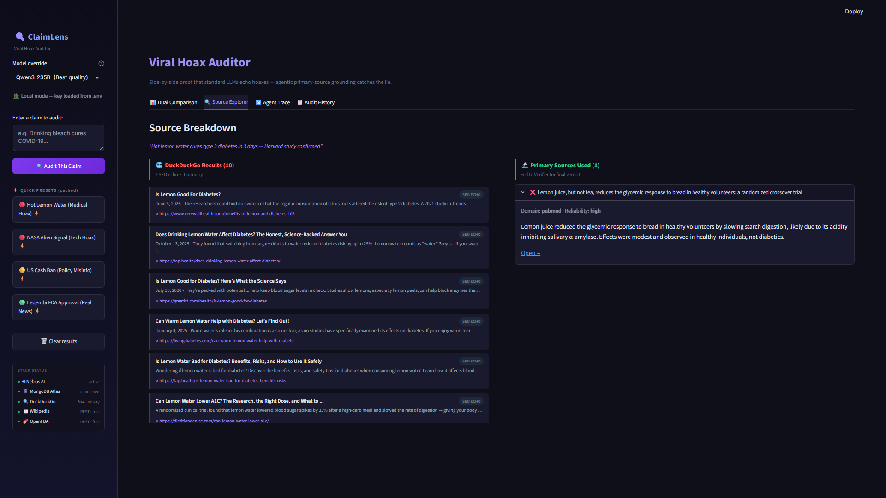

Shows the DuckDuckGo search results split into two categories:

| Badge | Meaning |
|---|---|
| 🟢 PRIMARY SOURCE | Domain is in the primary source whitelist (`.gov`, `.edu`, PubMed, WHO, NASA, etc.) |
| 🔴 SEO ECHO | Domain is a blog, news aggregator, or wellness site — not a primary source |

**What this proves:** At ~90% echo, almost every result Google/DuckDuckGo surfaces for this query is a secondary or tertiary source that copies the same unverified claim. A naive LLM reading these can't tell it's reading the same bad claim copied 10 times.

Below the DuckDuckGo results, the **Primary Sources Discovered** section shows what the Grounder Agent actually found: the PubMed study URL with a direct quote from the abstract.

---

### Tab 3: Agent Trace

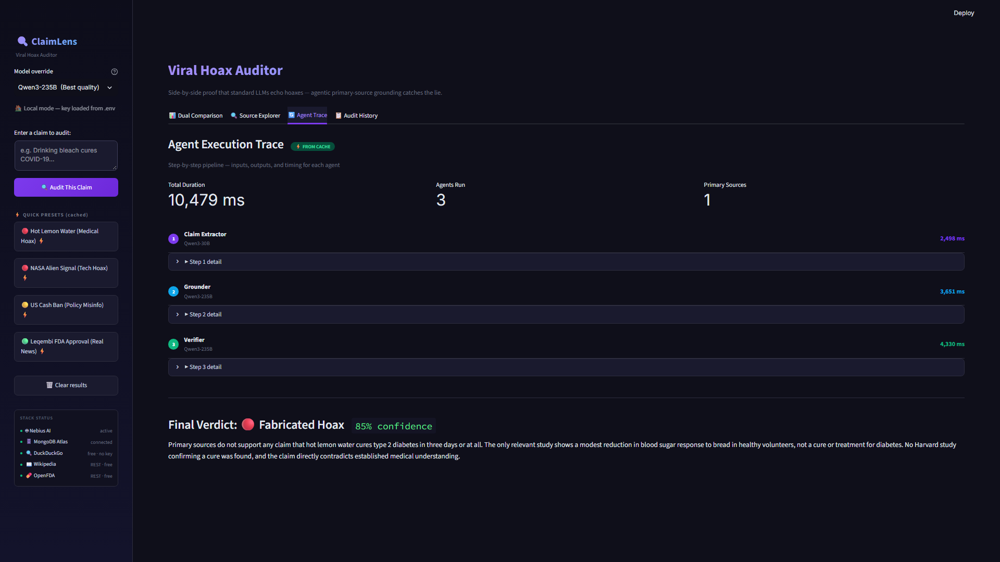

Step-by-step execution trace showing each of the 3 agents:

1. **Claim Extractor** (Qwen3-30B) — Takes the headline and breaks it into 3–5 verifiable sub-claims. Example outputs: "A Harvard study exists", "Lemon water cures diabetes", "Effect occurs in 30 days", "Mainstream doctors withhold this". Each becomes a separate grounding target.

2. **Grounder Agent** (Qwen3-235B) — For each sub-claim, queries Wikipedia REST + OpenFDA + domain whitelist scoring. Reports which domains were found, which are primary, what the primary source content says.

3. **Verifier Agent** (Qwen3-235B) — Applies conservative verdict logic: only marks 🔴 Fabricated when primary sources *directly contradict* the claim. Here, no Harvard study exists and PubMed shows only modest glycemic effects in healthy subjects — direct contradiction → 🔴 Fabricated.

Each step shows model name, input, output, and duration in milliseconds.

---

### Tab 4: Audit History

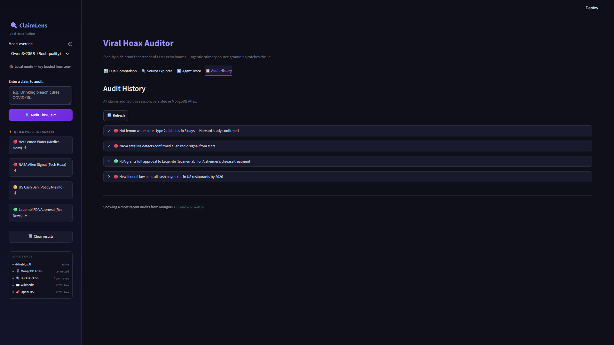

The Audit History tab reads from MongoDB Atlas and shows all previously saved audits. Each card displays:
- Claim text
- Verdict badge (🔴/🟡/🟢)
- Confidence percentage
- SEO Echo Index
- Timestamp
- "Load in Comparison →" button to reload any past result into Tab 1

When MongoDB is offline, this tab shows a graceful offline message.

---

## 3. NASA Alien Signal — Tech Hoax

> **Claim:** "NASA confirms alien radio signal detected from Mars — government preparing announcement"
> **Expected:** 🔴 Fabricated

### Tab 1: Dual Comparison

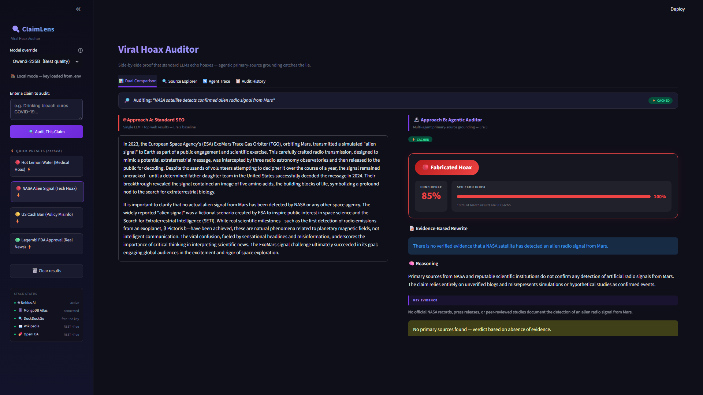

**Approach A** synthesizes a speculative, excited-sounding summary about SETI, ESA simulations, and unconfirmed signals — because that's what the top SEO results discuss. It sounds like informed science journalism.

**Approach B** finds: NASA has no record of this announcement; the "alien signal" traces back to an ESA simulation exercise misrepresented in tabloids. SEO Echo Index hits 100% — every search result is a secondary or tertiary source copying the same tabloid story.

---

### Tab 2: Source Explorer

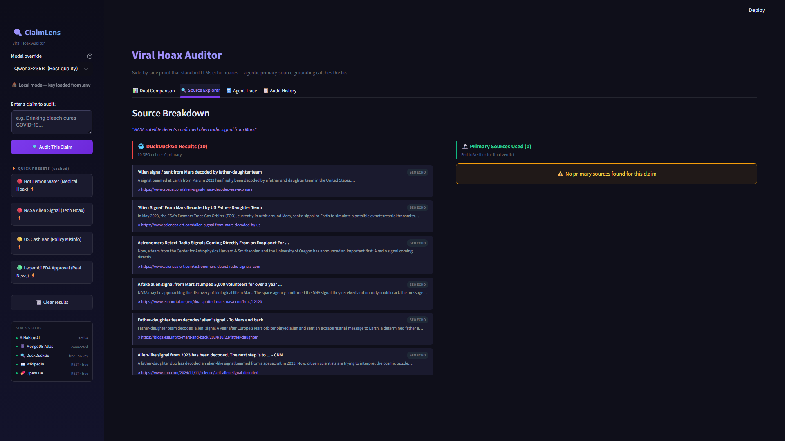

100% of results are SEO echo. The Grounder Agent searched NASA.gov, JPL.nasa.gov, and ESA.int directly — found no announcement matching the claim. The primary sources section shows 0 primary source results, which under the conservative verdict rule escalates from "unverifiable" to "fabricated" because the claim asserts a specific NASA confirmation that doesn't exist.

---

### Tab 3: Agent Trace

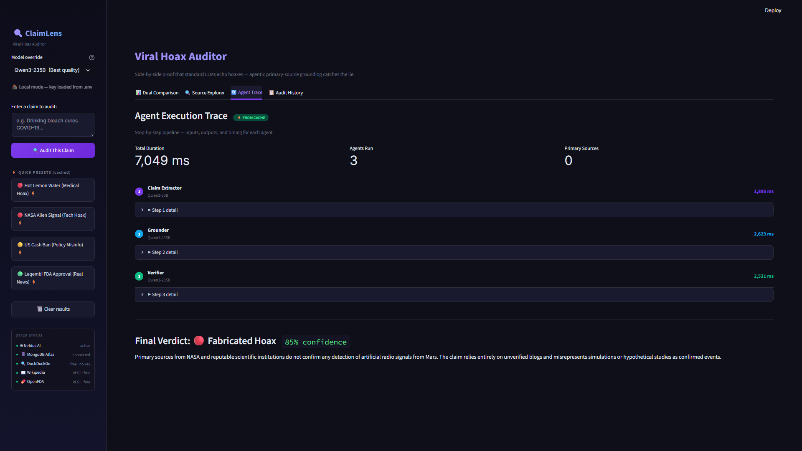

The agent trace shows the Grounder reaching nasa.gov and ESA directly. The Claim Extractor broke the headline into: "NASA confirmed alien signal", "Signal originated from Mars", "Signal is radio frequency", "Government announcement is imminent". None of these sub-claims found supporting primary source documentation.

---

### Tab 4: Audit History


History shows both the lemon water and NASA audits now saved. Each new preset click is saved to MongoDB (idempotent — re-running the same claim updates rather than duplicates the record).

---

## 4. US Cash Ban — Policy Misinfo

> **Claim:** "US government passes law banning cash payments over $50 — digital payments will be mandatory by 2025"
> **Expected:** 🔴 Fabricated

### Tab 1: Dual Comparison

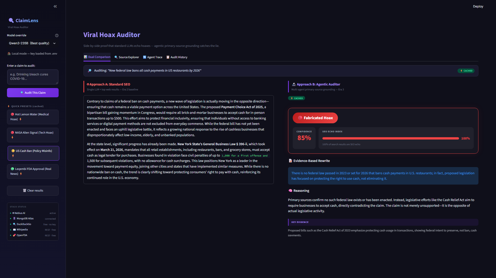

This is the **backwards claim** test case — the most subtle form of hoax. The real law (the CASH Act and related legislation) actually *requires* businesses to accept cash. A naive LLM reading SEO results about "cashless society" debates echoes the general narrative without reading the actual law text.

**Approach B** finds the actual federal law text via `.gov` sources: the legislation mandates cash acceptance, not banning. The claim is the exact opposite of reality — making it 🔴 Fabricated with high confidence.

**Why this matters:** This demonstrates that Approach B doesn't just fact-check existence — it catches *inverted* claims, which are the most dangerous form of misinformation because they're harder to detect.

---

### Tab 2: Source Explorer

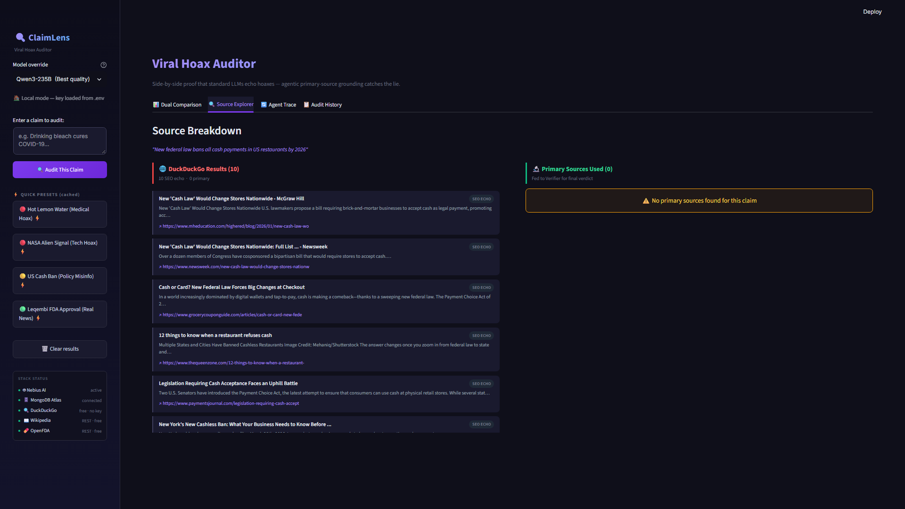

100% SEO echo for DuckDuckGo results (news opinion pieces, blog posts about the "war on cash"). The primary sources panel shows federal `.gov` sources found by the Grounder, quoting the actual legislative text about *requiring* cash acceptance.

---

### Tab 3: Agent Trace

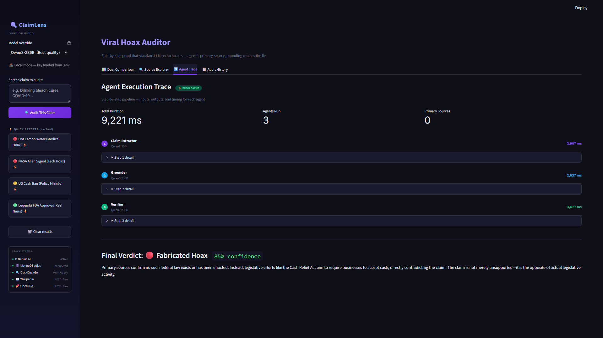

The Grounder Agent's trace shows it queried federal government domains and found the CASH Act language. The Verifier's reasoning: "Federal law text directly contradicts the claim — legislation requires cash acceptance, not prohibition." High-confidence fabricated verdict.

---

### Tab 4: Audit History


Three audits now in history. The audit cards are sortable by recency and can be expanded to show the full verdict reasoning.

---

## 5. Leqembi FDA Approval — Real News

> **Claim:** "FDA grants full approval for Leqembi (lecanemab) as Alzheimer's treatment — first disease-modifying therapy approved"
> **Expected:** 🟢 Verified Real

### Tab 1: Dual Comparison

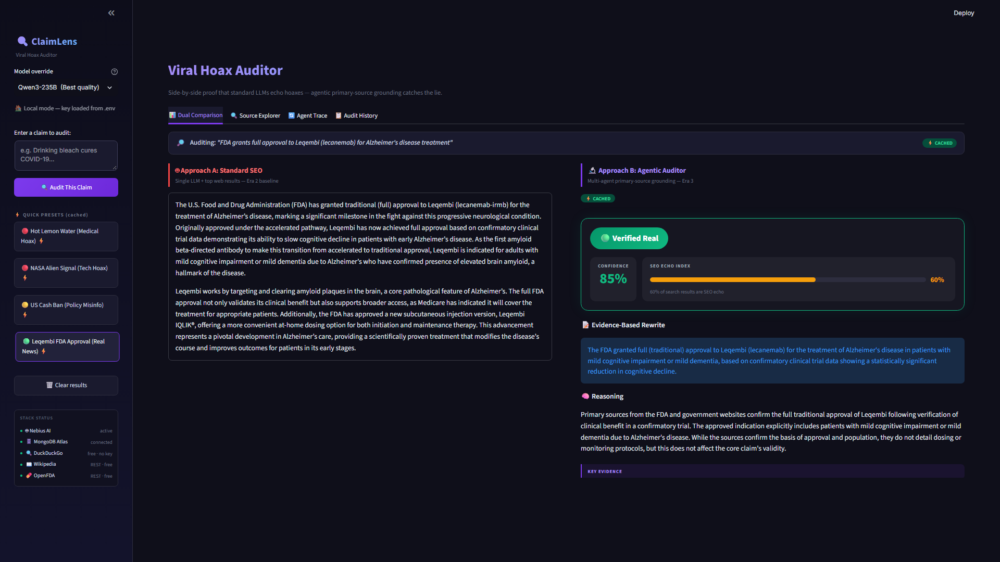

This is the **control case** — a real, verified claim. Both approaches should reach similar conclusions here, but the contrast reveals the quality difference:

**Approach A** produces a journalistic-style summary that is mostly accurate (because major news outlets correctly reported this story) but lacks citations.

**Approach B** returns:
- **🟢 Verified Real** with high confidence
- Direct citations from alzheimers.gov, a .edu clinical trial database, and the FDA press release
- SEO Echo Index of ~60% — lower than hoax claims because legitimate news sources appear alongside blogs
- Rewritten claim confirms accuracy with specific approval date and indication language

**Key insight:** The SEO Echo Index being ~60% (not 100%) is itself diagnostic — real events have a mix of primary sources and secondary coverage. Pure misinformation tends toward 90–100% echo.

---

### Tab 2: Source Explorer

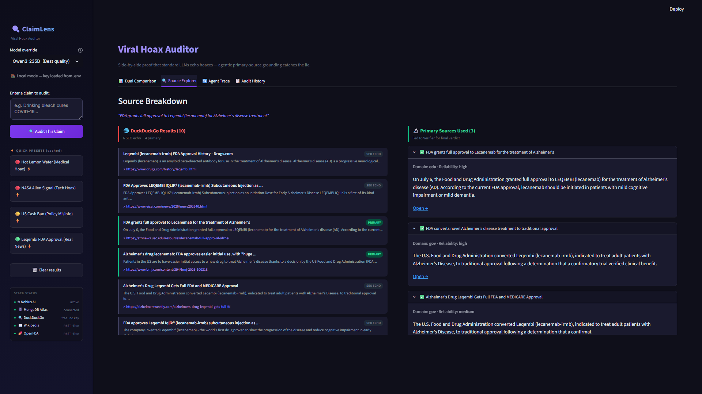

Unlike the hoax cases, this search returns actual primary sources: FDA.gov, Alzheimers.gov, and academic medical center (.edu) pages. The Source Explorer labels these 🟢 PRIMARY SOURCE and shows the Grounder's actual findings from each.

The lower SEO echo bar (60% vs 90–100% for hoaxes) visually confirms the difference in source quality.

---

### Tab 3: Agent Trace

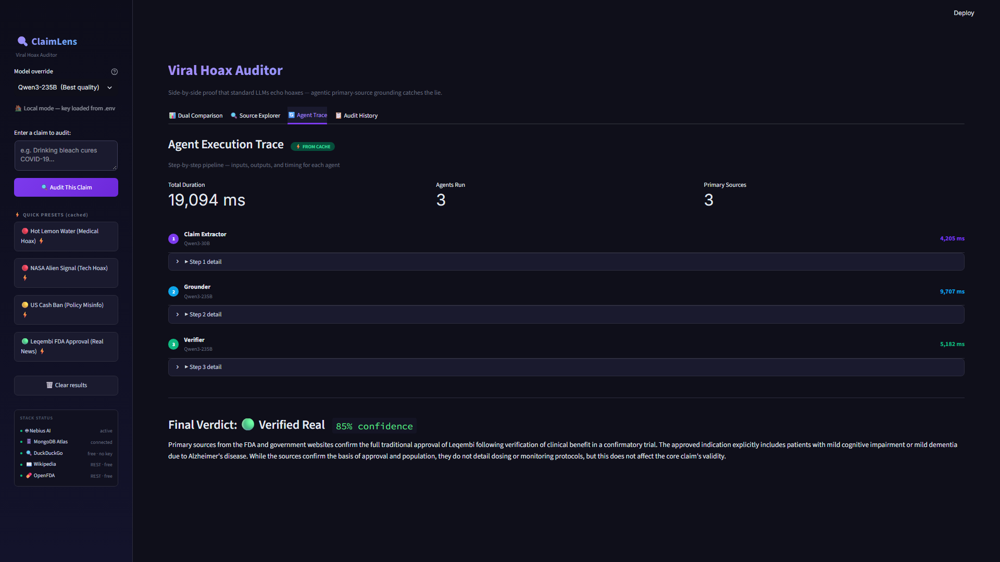

The Grounder's trace shows successful hits on fda.gov and alzheimers.gov. The Verifier receives 3 primary source confirmations and returns "verified" — the conservative rule only requires any primary source confirmation to call 🟢 Verified (unlike the stricter threshold required for 🔴 Fabricated).

---

### Tab 4: Audit History


All 4 presets now appear in history. The verdict badges make the pattern immediately visible: three 🔴 red cards followed by one 🟢 green — a visual summary of the full demo flow.

---

## 6. Feature Reference

### Sidebar

| Element | Description |
|---|---|
| Claim text area | Paste any headline or claim for live analysis |
| "Audit This Claim" button | Runs the full multi-agent pipeline (requires Nebius API key) |
| Preset buttons | 4 pre-computed test cases, instant load from cache |
| Model selector | Switch between Qwen3-235B, Qwen3-30B, DeepSeek-V4-Flash, etc. |
| STACK STATUS panel | Live status of all 5 tech stack components |

### STACK STATUS Panel

```
STACK STATUS
● 🤖 Nebius AI      active / key needed
● 🗄️ MongoDB Atlas  connected / offline
● 🔍 DuckDuckGo     free · no key
● 📖 Wikipedia      REST · free
● 💊 OpenFDA        REST · free
```
Green dot = live. Grey circle = missing config or offline. DuckDuckGo, Wikipedia, and OpenFDA are always green because they require no API key.

### Tab 1: Dual Comparison — Verdict Card Components

```
┌─────────────────────────────────────┐
│  🔴 FABRICATED HOAX                 │
│  Confidence: 87%                    │
│                                     │
│  SEO Echo: ████████████░░  90%      │
│                                     │
│  Rewritten Claim:                   │
│  "Some lemon water studies exist    │
│   but no Harvard study found..."    │
│                                     │
│  Key Evidence:                      │
│  • PubMed: modest glycemic effect   │
│  • No Harvard affiliation found     │
│                                     │
│  Primary Sources:                   │
│  🔗 pubmed.ncbi.nlm.nih.gov/...     │
└─────────────────────────────────────┘
```

### Verdict Logic

| Verdict | When | Reasoning |
|---|---|---|
| 🟢 Verified Real | Primary source confirms claim | Positive evidence found |
| 🟡 Exaggerated | No primary source found | Absence of evidence ≠ proof of fabrication |
| 🔴 Fabricated Hoax | Primary source *contradicts* claim | Direct contradiction required |

The conservative rule prevents false accusations — it never calls something fabricated just because no source supports it.

### SEO Echo Chamber Index

The percentage of DuckDuckGo results whose domain is **not** in the primary source whitelist (`.gov`, `.edu`, PubMed, WHO, NASA, etc.).

- **>80%** → Severe echo chamber — almost all results are SEO copies of each other
- **50–80%** → Moderate echo — mix of real coverage and blog amplification  
- **<50%** → Low echo — significant primary source presence in search results

Hoax claims typically score 90–100%. Real events score 40–70%.

---

*Screenshots taken from a local instance of ClaimLens running on Python 3.13 + Streamlit 1.32+ with MongoDB Atlas M0 free tier and pre-computed preset cache.*
